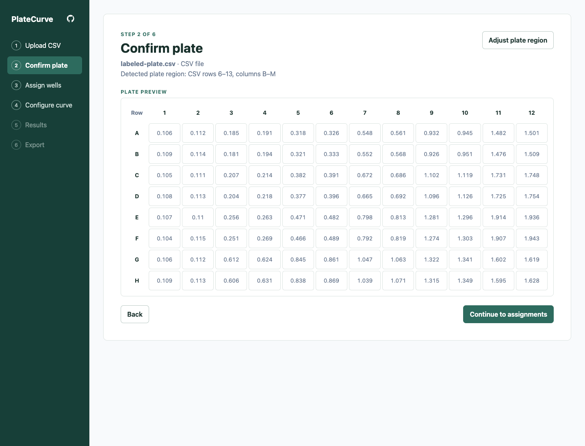
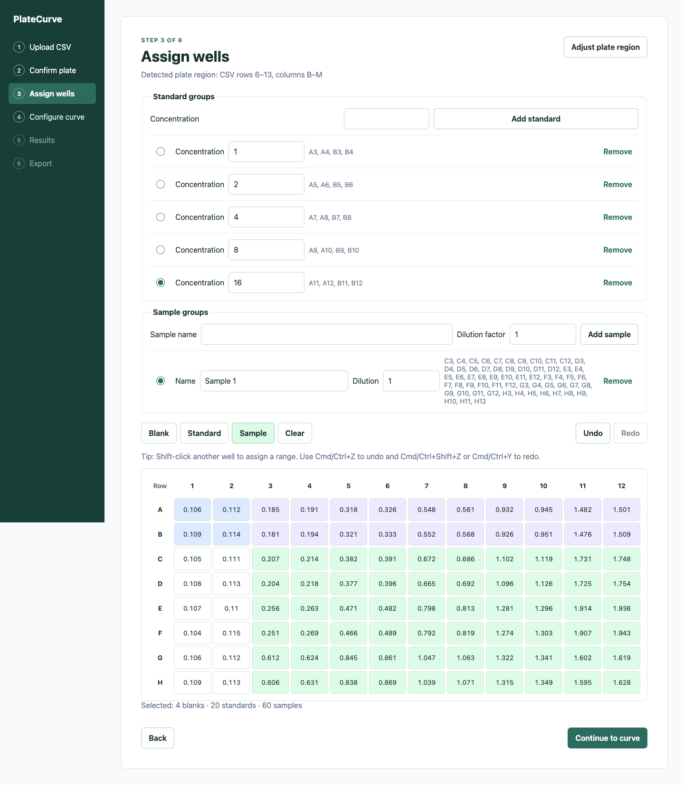
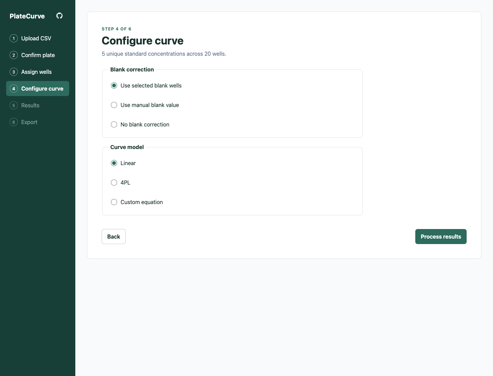
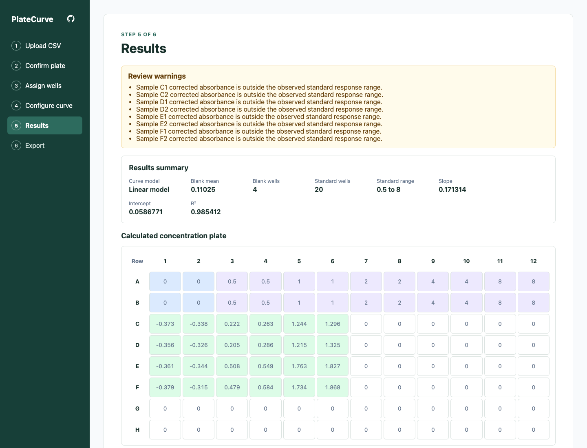
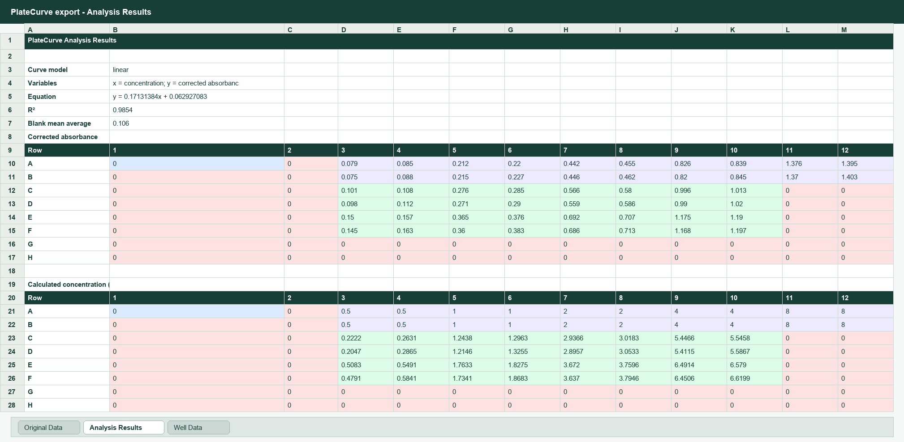
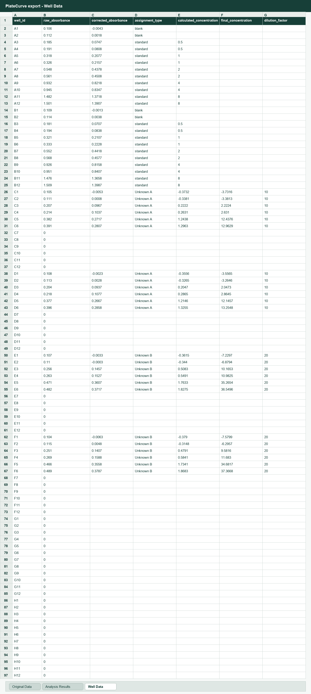

# PlateCurve

Analyze absorbance plate data up to 96 wells from ELISA, BCA, Bradford, MTT, OD600, and other colorimetric assays.

PlateCurve runs entirely in the browser. Upload plate data as a csv or xlsx., assign blanks, standards, and samples, fit a standard curve, review calculated concentrations, and export CSV or Excel results.

## Features

- 96-well plate selection with blanks, standards, samples, and range selection
- Standard and sample group assignment
- Blank mean correction, standard curve generation, and concentration calculation
- Linear regression and 4pl mode standard curve generation
- Allow user-inputted standard curve equation
- Color-coded concentration plate view
- CSV exports for results and curve summaries
- Excel workbook export with plate maps and calculated concentrations

## App showcase

### Load Plate Data



### Assign Wells



### Configure Curve



### Results



### Excel Export

Sheet 2: Analysis Results



Sheet 3: Well Data



## Using The App

PlateCurve can be used in two ways:

- Hosted app: `https://platecurve.pages.dev/`.
- Local download: clone the repository and run it on your computer.

The app is browser-based. Users do not need a server or database after the static site is built.

## Run Locally

Use this if you want to download the app and run it locally on your computer.

```bash
git clone https://github.com/thomasjin05/PlateCurve.git
cd PlateCurve
npm install
npm run dev
```

Then open the local URL printed by Vite, usually `http://localhost:5173`.

## Build Locally

```bash
npm run build
npx vite preview
```

The production files are written to `dist/`.
